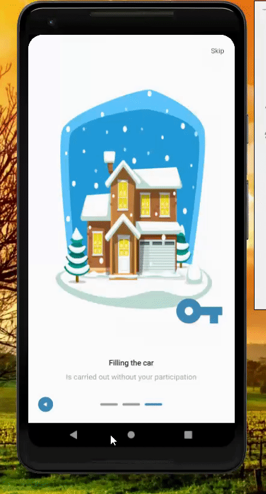

# Flutter UI demos

 Redux,
 CRUD Sqlite and Firebase,
 http request,
 webview,
 google and firebase auth,
 global notification strategy create and preview PDF,
 create and load csv,
 pagination,
 infinite scroll,
 touch id, 
 map,
 change theme,
 custom fonts,
 download & share files and more.

### Screenshots

       
   
                

### Created & Maintained By

[Javier González](https://github.com/javico2609)

###### Native integration like firebase it's only supported by android platform, you need add this config for IOS or disable this feature if you want run the app. ):

###### MapBox example: change in AndroidManifest.xml the 'MAPBOX_API_KEY'

## Social links

